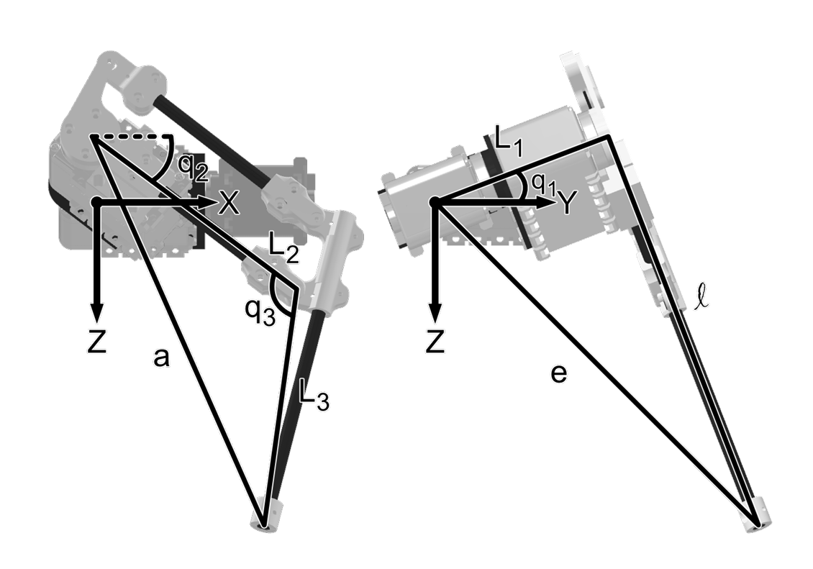
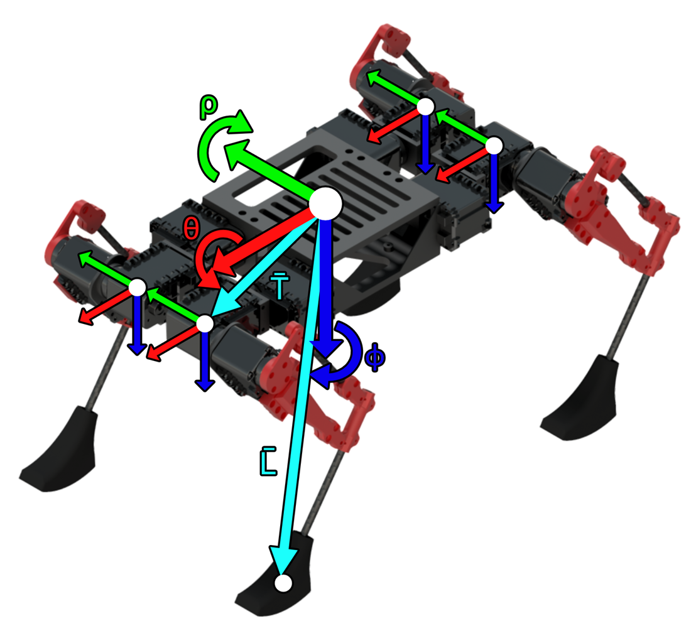

# Kinematic_Quadruped_Motion
โครงการนี้จัดทำขึ้นเพื่อศึกษาและจำลองกริยาและการเคลื่อนไหวของหุ่นยนต์สี่ขา โดยมี Input คือท่าทางหรือความเร็วในการเดินของหุ่น จากนั้นวิเคราะห์ในส่วนของ Forward Kinematics, Inverse Kinematics และ Jacobian เพื่อทำการหา Configuration ของ Joint บนขา และ Visualize ลักษณะของหุ่นออกมา
## Table Of Contents


## Introduction 
### จุดประสงค์โครงการ
1)	เพื่อศึกษาแบบจำลองจลนศาสตร์ที่ครอบคลุมของหุ่นยนต์ Quadruped Robot เพื่อจำลองการเคลื่อนไหวของหุ่นยนต์สี่ขา
2)	วิเคราะห์ Forward Kinematics และ Inverse Kinematics สำหรับการเดิน
### ขอบเขต
จำลองการเคลื่อนที่ของหุ่นยนต์ Quadruped Robot หรือหุ่นยนต์สุนัขขนาดเล็กเมื่อหุ่นอยู่ในบริบทต่างๆ เช่น เดิน เอียงตัว หรือหมอบ โดยการควบคุมผ่านค่าความเร็วของหุ่น, มุม Row Pitch และความสูงของหุ่นจากพื้น

#### ขอบเขตการศึกษา
    1.	ศึกษาเพียงส่วนของ Pose Kinematics Chain เท่านั้น
        - ศึกษาในส่วน Forward Kinematics
        - ศึกษาในส่วน Inverse Kinematics
        - ศึกษาในส่วน Velocity และ Acceleration ของแต่ละขา
    2.	ศึกษาเพียงส่วนของ Pose Kinematics Chain ในปริภูมิ 2 มิติ
        - สามารถคำนวณตำแหน่งและการเคลื่อนที่ของ Task Space ได้ในเพียง X-Axis และ Y-Axis เท่านั้น
    3.	จำนวณ DOF ของขาแต่ละข้าง
        - 2 DOF in XY Planar 
    4.	จำนวณ Actuator Pose Kinematics Chain
        -	2 DOF ที่ศึกษาจะใช้ Actuator เพียง 2 ตัวต่อขา 1 ข้างเท่านั้น
    5.	การกำหนด Input เพื่อใช้ในการคำนวณ
        -	ความเร็วของหุ่น (ในกรณีที่เดิน)
        -	มุม Row, Pitch ของหุ่น
        -	ความสูงของหุ่นจากพื้น

####	การ Visualize โดยใช้ Unity

        -	Visualization เป็นภาพ 3 มิติ
        -	ให้หุ่นยนต์เคลื่อนที่ไปมาในพื้นที่ 3 มิติได้

## Literature Review
### Kinematic analysis and trajectory of a Dog-like robot
#### 1. Dog-like Robot Structure

    ในส่วนของหุ่นยนต์หมาขนาดเล็ก หุ่นยนต์นั้นจะมี 4 ขา แต่ละขาจะมี 3 Degrees of Freedom ดังภาพ

<div align="center">
  
</div>

    โดยหุ่นยนต์นี้มี Workspace และมุมในการเคลื่อนที่จำกัด ในแต่ละข้อต่อสามารถเคลื่อนที่ได้ 300 องศา โดยกำหนดกรอบพิกัดทั่วไปสำหรับหุ่นทั้งตัวและกรอบพิกัดเฉพาะสำหรับขาแต่ละข้าง เพื่อจำกัดการเคลื่อนไหวของแต่ละข้อต่อ ในการควบคุมท่าทางต่างๆของหุ่นยนต์

<div align="center">
  
</div>

    การกำหนดองศาในท่า Home ของแต่ละข้อต่อ

<div align="center">
  
</div>


<div align="center">
  
</div>
    จากรูปด้านบนหุ่นยนต์มีค่าเริ่มต้น Joint Configuration ตามตารางด้านล่าง โดยที่ FR คือ ขาขวาด้านหน้า, FL คือ ขาซ้ายด้านหน้า, RR คือ ขาขวาด้านหลัง, RL คือขาซ้ายด้านหลัง, $θ_1$ คือ ข้อต่อหัวไหล่, $θ_2$ คือ ข้อต่อข้อพับและ $θ_3$ คือ ข้อต่อส่วนเข่า
#### 2. Kinematics

    ใน Forward Kinematics ขาทุกขามีรูปแบบเหมือนกันซึ่งสามารถเคลื่อนที่และเคลื่อนไหวได้โดยควบคุมข้อต่อทั้งหมดสามจุด แต่ในสมการที่เหมือนกันนั้น ตำแหน่งในการติดตั้งของขาจะต่างกันด้านซ้ายและส่วนของด้านขวาจะ Mirror จากด้านซ้าย กำหนดให้
- $a_1$	คือ ความยาวระหว่างปลายของส่วนต่อของ Joint ที่ 1 ถึง Joint ที่ 2
- $a_2$	คือ ความยาวระหว่าง Joint ที่ 2 ถึง Joint ที่ 3
- $a_3$	คือ ความยาวระหว่าง Joint ที่ 3 ถึงปลายขา
 - $d_0$	คือ ความยาวระหว่าง Joint ที่ 1 ถึง ปลายของส่วนต่อของ Joint ที่ 1
    
```math
x = -a_3sin(\theta_1)cos(\theta_2)cos(\theta_3)-a_3cos(\theta_2)sin(\theta_3)-a_2sin(\theta_1)cos(\theta_2)-a_1sin(\theta_1)\\
y = a_3sin(\theta_2)cos(\theta_3)+a_2sin(\theta_2)+d_0\\
z = -a_3cos(\theta_1)cos(\theta_2)cos(\theta_3)+a_3sin(\theta_1)sin(\theta_2)-a_2cos(\theta_1)cos(\theta_2)-a_1cos(\theta_1)
```
    ขาของหุ่นยนต์ถูกกำหนดในระบบพิกัดเฉพาะ โดยมีจุดเริ่มต้นอยู่ที่ข้อต่อไหล่หรือข้อต่อแรก จากสมการจลน์ศาสตร์สามารถสร้างเส้นทางการเคลื่อนที่ของการก้าวในรูปทรงต่างๆ เช่น รูปครึ่งวงรีตามที่แสดงในรูปด้านล่าง
<div align="center">
  
</div>

#### 3.  Four-legged walking gait 

    การสร้างจังหวะการเดินของหุ่นยนต์สามารถทำได้จากสมการ Kinematics หุ่นยนต์ที่มีลักษณะเหมือนสุนัขนี้ใช้ข้อต่อไหล่และเข่า โดยไม่ใช้ข้อต่อข้อพับเมื่อเดินไปข้างหน้า ข้อต่อข้อพับจะถูกใช้งานเมื่อหุ่นยนต์เลี้ยวหรือยืดขาออก ตามที่แสดงในรูปด้านล่าง

<div align="center">
  
</div>

### Design, Development and Control of a Quadruped Robot (Scott Fredriksson, 2021)[3]
#### 1. Mechanical Design of a Quadruped Robot

    จากวิทยานิพนธ์ฉบับนี้ได้ทำการออกแบบ Quadruped Robot โดยการออกแบบนี้มีแรงบันดาลใจมาจาก Mini Cheeta (MIT) และ SPOT (Boston Dynamics) เป้าหมายของคือการออกแบบให้มีความเรียบง่ายมากกว่าหุ่นตัวอื่นที่กล่าวมาข้างต้น ในส่วนของการออกแบบเชิงกล Mjukost ใช้การออกแบบขาที่คล้ายกับ Mini Cheeta โดยการวางตัว Actuator ไว้ใกล้กับตัวหุ่นมากที่สุด เพื่อลดโมเมนต์ความเฉื่อยของขา ทำให้สามารถควบคุมได้ง่ายขึ้นและลดแรงสั่นสะเทือนที่อาจจะส่งผลต่อชิ้นส่วนอื่นๆ โดยเลือกใช้ระบบ 5-bar ในการส่งแรงซึ่งต่างจาก Mini Cheeta ที่ใช้สายพานเพื่อส่งแรงจาก Actuator ไปยังหัวเข่าที่มีความยืดหยุ่นมากกว่าแต่ซับซ้อน โดยข้อเสียของวิธี 5-bar นั้นก็คือมุมในการทำงานของส่วนหัวเข่าจะถูกจำกัดการเคลื่อนที่

<div align="center">
  
</div>

#### 2.  Quadruped Robot Control

<div align="center">
  
</div>

    จากรูปด้านบนที่แสดงโครงสร้างในระบบ Control ของหุ่นยนต์ ซึ่งควบคุมการเดินและตำแหน่งของหุ่นยนต์ โดยในส่วนของ Inverse Kinematics Model จะทำการแปลงจากตำแหน่งของขาเป็นมุมของ Servo หากความเร็วต่ำพอ ระบบจะควบคุมให้ขาเคลื่อนตามเส้นตรงและส่งสัญญาณกลับเมื่อถึงจุดที่ตั้งไว้ ในการควบคุมหุ่นยนต์จำเป็นต้องสามารถแปลงตำแหน่งของ Servo เป็นตำแหน่งขาของหุ่นยนต์ในปริภูมิยูคลิดได้ ขาทั้งหมดใช้เป็นแบบจำลองเดียวกันมีการปรับแต่งเล็กน้อยเพื่อให้เป็นไปในทิศทางเดียวกัน โดยแกนของหุ่นยนต์ แกน Z มีทิศทางชี้ลง, แกน X มีทิศทางไปทางด้านขวา ส่วนแกน Y มีทิศทางพุ่งเข้าหาตัว กำหนดให้

$a$	คือ ระยะทางที่คำนวณโดยใช้กฎของโคไซน์จากความยาว $L_2$, $L_3$ และมุม $q_3$

$l$	คือ ความยาวที่ได้จากการคำนวณด้วยฟังก์ชันตรีโกณมิติ ขึ้นอยู่กับมุม $q_2$ และความยาวของ $a$

$e$	คือ ความยาวที่คำนวณโดยใช้ทฤษฎีบทพีทาโกรัส จากการรวมระยะ $l$ และ $L_2$
    
$L_2$ คือ ความยาวของลิงก์ที่เชื่อมต่อระหว่างข้อต่อสะโพกกับข้อต่อหัวเข่า 

$L_3$ คือ ความยาวของลิงก์ที่เชื่อมต่อระหว่างข้อต่อหัวเข่ากับปลายขา 

$q_1$	คือ มุมที่ข้อต่อของขาส่วนสะโพก (Hip)
	
$q_2$	คือ มุมที่ข้อต่อของขาส่วนหัวเข่า (Knee)
	
$q_3$	คือ มุมที่ข้อต่อของขาส่วนปลายขา (End-effector)
    
#### 2.1 Kinematic Model
ในการทำ Kinematics Model นั้น ใช้ความยาวของตัวแปร a, l และ e โดยหาความยาวของ a จากกฎของ Cosine 
``` math
a = \sqrt{L_2^2+L_3^2-2L_2L_3*cos(q_3)}
````
ในการหา l มุมของ $V_(a,l)$  ซึ่งเป็นมุมระหว่าง a และ l สามารถคำนวณได้จาก
``` math
V_(a,l) = q_2 + \frac{\pi}{2} - V_(L_2,a)
```
ในการหามุม $V_(L_2,a)$ ในสมการด้านบนได้มาจาก กฎของ cosine ดังนี้
``` math
\frac{sin(V_(L_2,a)}{L_3}) = \frac{sin(q_3)}{a}
\\
V_(L_2,a) = sin^-1(\frac{L_3*sin(q_3)}{a})
```
สามารถหาความยาว l ได้จากสมการ ด้านบนทั้งสองได้เป็น
``` math
l = a * cos(q_2+\frac{\pi}{2}-sin^-1(\frac{L_3*sin(q_3)}{a}))
```
ในส่วนของความยาว e และตำแหน่งบนแกน X สามารถหาได้จากสมการพีทาโกรัส
``` math
e = \sqrt{l^2+L_2^2}\\
x = \sqrt{a^2-l^2}
```
ต้องหามุม $V_(e,Z)$ เพื่อหาตำแหน่งของ Y และ Z จากสมการดังนี้
``` math
V_(e,z) = q_1+\frac{\pi}{2}-V_(L_1,e)
```
<div align="center">
  
</div>

มุมของ $V_(L_1,e)$ สามารถหาได้จากสมการ
``` math
V_(L_1,e) = sin^-1(\frac{l}{e})
```
ใช้สมการตรีโกณมิติเพื่อหาค่า Y และ Z
``` math
y = e*sin(q_1+\frac{\pi}{2}- sin^-1(\frac{l}{e})\\
z = e*cos(q_1+\frac{\pi}{2}- sin^-1(\frac{l}{e})
```
สามารถหาค่าสมการสำหรับ Kinematic Model ได้ดังนี้
``` math
x = \sqrt{a^2-l^2}\\
y = e*sin(q_1+\frac{\pi}{2}- sin^-1(\frac{l}{e})\\
z = e*cos(q_1+\frac{\pi}{2}- sin^-1(\frac{l}{e})
\\where\\
a = \sqrt{L_2^2+L_3^2-2L_2L_3*cos(q_3)}\\
l = a * cos(q_2+\frac{\pi}{2}-sin^-1(\frac{L_3*sin(q_3)}{a})\\
e = \sqrt{l^2+L_2^2}
```
#### 2.2 Inverse Kinematic Model of a Quadruped Robot

<div align="center">
  
</div>

ปัญหาของ Inverse Kinematics คือระบบพิกัดยึดติดกับตัวหุ่นยนต์ ทำให้ทิศทางการเคลื่อนไหวไม่สอดคล้องเมื่อหุ่นยนต์มีการเอียง จึงจำเป็นต้องสร้างโมเดลที่แปลงตำแหน่งจากระบบพิกัดของหุ่นยนต์ไปยังขา โดยใช้เมทริกซ์การหมุน ซึ่งเป็นผลคูณของเมทริกซ์การหมุนตามแกนแต่ละแกน เมื่อแปลงระบบพิกัดนี้ หุ่นยนต์สามารถปรับตำแหน่งตัวเองได้ 6 องศาอิสระโดยไม่ต้องย้ายขา เหมาะสำหรับการปรับตัวเพื่อความสมดุลหรือรับแรงจากภายนอก
``` math
\begin{bmatrix} X_L \\ Y_L \\ Z_L \\ 1 \end{bmatrix} = \begin{bmatrix} R & -\vec{T} \\ 0_{1x3} & 1 \end{bmatrix} * \begin{bmatrix} \vec{L} \\ 1 \end{bmatrix}
```
#### 2.3 Walking
Mjukost ใช้อัลกอริทึมการเดินแบบวงจรเปิดที่เรียบง่าย ขาทั้งหมดเคลื่อนตามเส้นทางที่กำหนดไว้ล่วงหน้า โดยการเดินแบบ Trot จะให้ขาขวาหน้าและซ้ายหลังเริ่มที่จุดกลางของเส้นทาง การหมุนเส้นทางของเท้ารอบแกน Z ช่วยควบคุมทิศทางการเดิน และหุ่นยนต์สามารถเลี้ยวโดยให้ขาหลังเคลื่อนไปในทิศตรงข้ามกับขาหน้า

<div align="center">
  
</div>

### Inverse Kinematic Analysis Of A Quadruped Robot 9 (Muhammed Arif Sen, Veli Bakircioglu, Mete Kalyoncu, 2017)
#### Kinematics Analysis

<div align="center">
  
</div>

โดยมีการกำหนดพารามิเตอร์เบื้องต้นตามตารางดังนี้

<div align="center">
  
</div>

ดังที่แสดงในรูปที่ 11 ตำแหน่งของขาทำให้โครงสร้างของตัวหุ่นยนต์เปลี่ยนแปลงได้ จึงต้องศึกษาสมการจลน์ศาสตร์ระหว่างการหมุน (∅,Φ,$w$) รอบศูนย์กลางของระบบพิกัดตัวหุ่นยนต์ (XM, YM, ZM) และระบบพิกัดปลายขาแต่ละข้าง (X4, Y4, Z4) เพื่อกำหนด

ตำแหน่งและการหมุนของจุดศูนย์กลางหุ่นยนต์ในพื้นที่ทำงาน ใช้เมทริกซ์การแปลงในสมการที่ 5 ซึ่งได้มาจากเมทริกซ์การหมุนในสมการที่ 1 ถึงสมการที่ 4

สมการที่ 1
``` math
R_x = \begin{bmatrix} 1 & 0 & 0 & 0 \\ 0 & cos(w) & - sin(w) & 0 \\ 0& sin(w) & cos(w) & 0 \\ 0& 0& 0&1\end{bmatrix} 
```
สมการที่ 2
``` math
R_y = \begin{bmatrix} cos(∅) & 0 & sin(∅) & 0 \\ 0 & 1 & 0 & 0 \\ -sin(∅) & 0 & cos(∅) & 0 \\ 0 & 0 & 0 & 1\end{bmatrix} \\
```
สมการที่ 3
``` math
R_z = \begin{bmatrix} cos(Φ) & -sin(Φ) & 0 & 0 \\ sin(Φ) & cos(Φ) & 0 & 0 \\ 0 & 0 & 1 & 0 \\ 0 & 0 & 0 & 1\end{bmatrix} \\
```
สมการที่ 4
``` math
R_(xyz) = R_xR_yR_z
```
สมการที่ 5 
``` math
T_M = R_(xyz) \times \begin{bmatrix} 1 & 0 & 0 & x_m \\ 0 & 1 & 0 & y_m \\ 0 & 0 & 1 & z_m \\ 0 & 0 & 0 & 1\end{bmatrix}
```
สมการ Kinematics ระหว่างระบบพิกัดศูนย์กลางของตัวหุ่นยนต์ ($x_m$, $y_m$, $z_m$) และระบบพิกัดหลักของขาแต่ละข้าง ($x_0$, $y_0$, $z_0$) ถูกกำหนดโดยเมทริกซ์การแปลงตามสมการที่ 6 ถึงสมการที่ 9 ตำแหน่งและการหมุนของขาแต่ละข้างสามารถคำนวณได้ตามตำแหน่งและการหมุนของตัวหุ่นยนต์

สมการที่ 6
``` math
T_(rightback) = T_M * \begin{bmatrix} cos(\frac{\pi}{2}) & 0 & sin(\frac{\pi}{2}) & \frac{-L}{2} \\ 0 & 1 & 0 & 0 \\ -sin(\frac{\pi}{2}) & 0 & cos(\frac{\pi}{2}) & \frac{W}{2} \\ 0 & 0 & 0 & 1\end{bmatrix}
```
สมการที่ 7
``` math
T_(rightfront) = T_M * \begin{bmatrix} cos(\frac{\pi}{2}) & 0 & sin(\frac{\pi}{2}) & \frac{L}{2} \\ 0 & 1 & 0 & 0 \\ -sin(\frac{\pi}{2}) & 0 & cos(\frac{\pi}{2}) & \frac{W}{2} \\ 0 & 0 & 0 & 1\end{bmatrix}
```
สมการที่ 8
``` math
T_(leftfront) = T_M * \begin{bmatrix} cos(\frac{-\pi}{2}) & 0 & sin(\frac{-\pi}{2}) & \frac{L}{2} \\ 0 & 1 & 0 & 0 \\ -sin(\frac{-\pi}{2}) & 0 & cos(\frac{-\pi}{2}) & \frac{-W}{2} \\ 0 & 0 & 0 & 1\end{bmatrix}
```
สมการที่ 9
``` math
T_(rightback) = T_M * \begin{bmatrix} cos(\frac{\pi}{2}) & 0 & sin(\frac{\pi}{2}) & \frac{-L}{2} \\ 0 & 1 & 0 & 0 \\ -sin(\frac{\pi}{2}) & 0 & cos(\frac{\pi}{2}) & \frac{-W}{2} \\ 0 & 0 & 0 & 1\end{bmatrix}
```
Forward kinematics ของหุ่นยนต์เกี่ยวข้องกับตำแหน่ง ความเร็ว และความเร่งของข้อต่อต่าง ๆ ส่วนจลนศาสตร์ผกผันคือการคำนวณหาค่ามุมของข้อต่อเพื่อให้ปลายขาหุ่นยนต์เคลื่อนไปยังตำแหน่งที่ต้องการ โดยการวิเคราะห์ขาเดียวก็เพียงพอเนื่องจากขาแต่ละข้างมีโครงสร้างเหมือนกันแต่หมุนต่างกัน รูปที่ 12 แสดงระบบพิกัดและมุมของข้อต่อขาหน้าขวา ส่วนพารามิเตอร์ DH ที่ใช้ในการคำนวณจลนศาสตร์ของขาแสดงในตาราง


<div align="center">
  
</div>

ตารางแสดง DH Parameter

<div align="center">
  
</div>

ในการแปลง Matrix แต่ละตัว $T_0^1$, $T_1^2$, $T_2^3$, $T_3^4$ ในสมการที่ 10, 11, 12, 13 และ Forward Kinematics Matrix $T_0^4$ ในสมการที่ 14 Forward Kinematics ของส่วนขาในรูปที่ 13
สมการที่ 10
``` math
T_0^1 = \begin{bmatrix} cos(\theta_1) & -sin(\theta_1) & 0 & -L_1cos(\theta_1) \\ sin(\theta_1) & cos(\theta_1) & 0 & -L_1sin(\theta_1) \\ 0 & 0 & 1 & 0 \\ 0 & 0 & 0 & 1\end{bmatrix} \\
```
สมการที่ 11
``` math
T_1^2 = \begin{bmatrix} cos(\theta_1) & -sin(\theta_1) & 0 & -L_1cos(\theta_1) \\ sin(\theta_1) & cos(\theta_1) & 0 & -L_1sin(\theta_1) \\ 0 & 0 & 1 & 0 \\ 0 & 0 & 0 & 1\end{bmatrix} \\
```
สมการที่ 12
``` math
T_2^3 = \begin{bmatrix} cos(\theta_2) & -sin(\theta_2) & 0 & L_2cos(\theta_2) \\ sin(\theta_2) & cos(\theta_2) & 0 & L_2sin(\theta_2) \\ 0 & 0 & 1 & 0 \\ 0 & 0 & 0 & 1\end{bmatrix} \\
```
สมการที่ 13
``` math
T_2^3 = \begin{bmatrix} cos(\theta_3) & -sin(\theta_3) & 0 & L_3cos(\theta_3) \\ sin(\theta_3) & cos(\theta_3) & 0 & L_3sin(\theta_3) \\ 0 & 0 & 1 & 0 \\ 0 & 0 & 0 & 1\end{bmatrix} \\
```
สมการที่ 14
``` math
T_0^4 = T_0^1T_1^2T_2^3T_3^4 = \begin{bmatrix} m & m & m & m \\ m & m & m & m\\ m & m & m & m \\ m & m & m & m\end{bmatrix} \\
```
ตารางแสดง Forward Kinematics ของส่วนขา

<div align="center">
  
</div>

หลังจากที่ได้ TRANSFORMATION MATRIX และ FORWARD KINEMATICS ที่ต้องใช้เพื่อทำ INVERSE KINEMATICS จะใช้การคำนวณทางคณิตศาสตร์ โดยสมการที่แสดงตำแหน่งเชิงมุมของข้อต่อ $Θ_1$, $Θ_2$, $Θ_3$ ที่ได้จากสมการที่ 15 และ 16, 17 โดยจะมีสมการ NON-LINEAR ใน INVERSE KINEMATICS. ในการคำนวณอาจไม่ได้คำตอบทั้งหมด นอกจากนี้อาจได้คำตอบหลายคำตอบสำหรับตำแหน่งขาของหุ่นในการเคลื่อนที่ ดังนั้น ขาที่ 1 และ 3 ของหุ่น และขาที่ 2 และ 4 จึงถูกทำให้เป็นโครงสร้างจลศาสตร์เดียวกันที่มีการตั้งค่าต่างกัน

สมการที่ 15
``` math
\theta_1 = -atan2(-y_4,x_4)-atan2(\sqrt{x_4^2+y_4^2-L_1^2},-L_1)
```
สมการที่ 16
``` math
\theta_2 = atan2(z_4,\sqrt{x_4^2+y_4^2-L_1^2})-atan2(L_3sin(\theta_3),L_2+L_3cos(\theta_3))
```
สมการที่ 17
``` math
\theta_3 = atan2(-\sqrt{1-D^2},D) (Legsfor 1 and 3)\\
\theta_3 = atan2(\sqrt{1-D^2},D) (Legsfor 2 and 4)
\\D = \frac{x_4^2+y_4^2-L_1^2+z_4^2-L_2^2-l_3^2}{2L_2L_3}
```
### System Diagram / System Overview (Function and Argument)

<div align="center">
  
</div>

1)	ฟังก์ชันสำหรับกำหนดพฤติกรรมของหุ่น
เป็นฟังก์ชันที่รับค่าความเร็วของหุ่น, มุม Row Pitch และความสูงของหุ่นจากพื้น เพื่อนำค่าไปคำนวณและแสดง Output ออกมาผ่านการ Visualization
2)	ฟังก์ชันสำหรับการหา Inverse Kinematics
ฟังก์ชันที่ใช้ในการแปลงค่า มุม Row Pitch และความสูงของหุ่นจากพื้น (Task space) เป็นค่ามุมของแต่ละข้อต่อของขา 
(Configuration space)
3)	ฟังก์ชันสำหรับการควบคุมพฤติกรรมของหุ่น
โดยจาก Input ที่รับค่า Velocity ของหุ่นแล้วจะทำการคำนวณเข้า Feedback loop ของ Velocity with Gravity Compensation Controller
    -	Velocity control จะทำการรับค่า error ของความเร็วของหุ่นในปัจจุบันกับ input และทำการ gain ค่าเพื่อแปลงเป็น Torque และนำเข้า Plant ของหุ่น (Quadruped Robot)
    -	Quadruped Robot คือ plant ของหุ่นยนต์ที่สร้าง model Forward kinematic และ Dynamic ของหุ่น
    -	Gravity control เป็นค่า Gain ของ Feedback
4)	ฟังก์ชันสำหรับการควบคุมหุ่นยนต์
ทำการรับค่าจากการคำนวณพฤติกรรมของแต่ละข้อต่อและคำนวณแปลงเป็นลักษณะพฤติกรรมของหุ่น
5)	การแสดงผลลักษณะพฤติกรรมของหุ่นยนต์ (Visualization)
รับค่าผลลัพธ์ที่ได้จากการคำนวณของ model หุ่นยนต์และแสดงออกมาเป็นภาพลักษณะการเคลื่อนที่และท่าทางของหุ่น

## Calculation

ทำการตั้งเฟรมอ้างอิงเบื้องต้นขึ้นมาเพื่อกำหนดเฟรมหลักของหุ่นยนต์และเฟรมของขาแต่ละข้างของหุ่นยนต์ `เนื่องจาก simulate ใน unity ซึ่งใช้แกนด้วยกฎมือซ้าย`

<div align="center">
  
</div>

### Forward Kinematics
กำหนด

$l_1$ คือ ความยาวของข้อต่อจาก Hip joint ไป Knee joint<br>
$q_1$ คือ คือ มุมข้อต่อของ Hip Joint<br>
$l_2$ คือ ความยาวของข้อต่อจาก Knee joint ไป Foot<br>
$q_2$ คือ คือ มุมข้อต่อของ Knee Joint<br>
FR คือ ขาขวาด้านหน้า<br>
FL คือ ขาซ้ายหน้า<br>
RR คือ ขาขวาด้านหลัง<br>
RL คือ ขาซ้ายด้านหลัง<br>

จากรูป<br>
<div align="center">
  
</div>
จะได้ว่า<br>

```math
x = l_{1}cos(q_{1}) + l_{2}cos(q_{2}+q_{3})\\
z = l_{1}sin(q_{1}) + l_{2}sin(q_{2}+q_{3})
```

เมื่อทำการแปลงเฟรมให้ออกมาอยู่ในรูปแบบของขาจะได้ดังรูป

<div align="center">
  
</div>

```math
x = l_{1}cos(\theta_1+135^\circ) + l_{2}cos(\theta_2+\theta_3+90^\circ)\\
z = l_{1}sin(\theta_1+135^\circ) + l_{2}sin(\theta_2+\theta_3+90^\circ)
```

ทำให้ได้ Transformation Matrix ของสมการ Forward Kinematics ในทุกๆขาของหุ่นยนต์ออกมาดังนี้

```math
T_{[]foot}^{[]} = 
\begin{bmatrix} 1 & 0 & 0 & l_{1}cos(\theta_1+135^\circ) + l_{2}cos(\theta_2+\theta_3+90^\circ)\\
0 & 1 & 0 & 0 \\
0 & 0 & 1 & l_{1}sin(\theta_1+135^\circ) + l_{2}sin(\theta_2+\theta_3+90^\circ)\\
0 & 0 & 0 & 1
\end{bmatrix}
```

กำหนดให้<br>
$S_{FR}^0$ คือ Translation จากจุดกลางของหุ่นไปยังเข่าของขาข้างขวาด้านหน้า <br>
$S_{RR}^0$ คือ Translation จากจุดกลางของหุ่นไปยังเข่าของขาข้างขวาด้านหลัง <br>
$S_{FL}^0$ คือ Translation จากจุดกลางของหุ่นไปยังเข่าของขาข้างซ้ายด้านหน้า <br>
$S_{RL}^0$ คือ Translation จากจุดกลางของหุ่นไปยังเข่าของขาข้างซ้ายด้านหลัง <br>

<div align="center">
  
</div>

จะได้ว่า
```math
S_{FR}^0 = \begin{bmatrix} x_F \\ -y_R \\ 0 \end{bmatrix} \\
S_{RR}^0 = \begin{bmatrix} -x_R \\ -y_R \\ 0 \end{bmatrix} \\
S_{FL}^0 = \begin{bmatrix} x_F \\ y_L \\ 0 \end{bmatrix} \\
S_{RL}^0 = \begin{bmatrix} -x_R \\ y_L \\ 0 \end{bmatrix}
```
สมการสุดท้ายของ Transformation matrix ได้เป็นรูปแบบดังนี้
```math
T_{[]foot}^0 = S_{[]}^0 \times T_{[]foot}^{[]}
```

### Inverse Kinematics

<div align="center">
  
</div>

จะได้ว่า
```math
r = \sqrt{x^2 + z^2} \\[1em]
cos(\theta_2) = \frac{r^2 - l_1^2 - l_2^2}{2l_1l_2} \\[1em]
sin(\theta_2) = \gamma\sqrt{1-cos^2(\theta_2)} \\[1em]
\beta = Atan2(l_2s_2 , l_2c_2 + l_1) \\[1em]
\alpha = Atan2(z,x) \\[1em]
\therefore \quad \theta_1 = \alpha - \beta \quad\quad \theta_2 = Atan2(s_2,c_2)
```

### Control speed

โดยการสั่งการเดินจะเป็นการสั่งไปที่ Task Space ของเท้าหุ่นและทำการ Inverse Kinematics เพื่อสั่ง Configuration ของขา โดย
```math
\begin{bmatrix} x \\ y \\ z \end{bmatrix} =
\begin{bmatrix} x_{foot} \\ y_{foot} \\ z_{foot} \end{bmatrix}+
\begin{bmatrix} \frac{v}{2}(1-cos(\theta)) \\ 0 \\ -\frac{v}{2}(sin(\theta)) \end{bmatrix}
; 0^\circ \leq \theta \leq 180^\circ \\[1em]

\begin{bmatrix} x \\ y \\ z \end{bmatrix} =
\begin{bmatrix} x_{foot} \\ y_{foot} \\ z_{foot} \end{bmatrix}+
\begin{bmatrix} \frac{v}{2}(1-cos(\theta)) \\ 0 \\ 0 \end{bmatrix}
; 180^\circ < \theta < 360^\circ
```
จากข้างต้นจะได้ path การเคลื่อนที่ของขาดังนี้

<div align="center">
  
</div>

ในส่วนของการควบคุมความเร็วในการเดิน จะรับ input เป็นความเร็ว v และความเร็วของหุ่นยนต์จะขึ้นอยู่จังหวะที่เท้าของหุ่นสัมผัสกับพื้นและผลักตัวไปข้างหน้า (ระยะทาง v จากรูป) ดังนั้นความเร็วของหุ่นจะขึ้นอยู่กับระยะทาง v และ duration ในการเคลื่อนที่ให้ครบหนึ่งรอบของขาหุ่น


## Posture

เราศึกษาท่าทางของสัตว์สี่ขาทั้งหมด 3 ท่าทาง ได้แก่

    - ท่าหมอบ
    - การเอียงตัว
    - การเดิน

### Squat

โดยในท่าหมอบจะรับ input เป็นความสูงของลำตัวหุ่นจากพื้น

<div align="center">
  
</div>

<br>

จากรูปเราสามารถคำนวณความสูงของหุ่นจากพื้น ได้จากการคำนวณระยะห่างระหว่างเท้า (สีม่วง) และหัวไหล่ (สีฟ้า) และบวกรัศมีของเท้าหุ่น (ในที่นี้คือ 0.5) เนื่องจากเราอ้างอิงแกนของแต่ละขาจากบริเวณหัวไหล่ ดังนั้นเราจะได้ configuration ของแต่ละ joint ของขาจากการนำระยะ x ไปใส่ในสมการ inverse kinematic 

<p align="center">
  <video src="Videos/Squat.mp4" width="1100px" controls></video>
</p>

### Tilted

โดยในท่าเอียงตัวจะรับ input เป็นองศาในแต่ละแกน

<div align="center">
  
</div>

เราสามารถหา configuration ของแต่ละ joint ได้จากระยะ x ซึ่งหาได้จาก L/2 * tan(theta) โดย L คือความกว้างและความยาวของหุ่นในแต่ละแกนที่สนใจ และนำค่า x ไปใส่ในสมการ inverse kinematic 

<p align="center">
  <video src="Videos/tilted.mp4" width="1100px" controls></video>
</p>

### Walk
เราได้ทำการศึกษาท่าทางในการเดินของสัตว์สี่ขา และได้สนใจใน ท่า crawl(walk) และ ท่า trot


และได้ลักษณะในการเคลื่อนที่ของเท้าในขาแต่ละข้างดังนี้

<div align="center">
  
</div>

#### Crawl

โดยในท่า crawl สัตว์จะใช้ขาทีละข้างในการยก และอีกสามขาที่ติดอยู่กับพื้นจะใช้ในการทรงตัวและผลักให้ตัวสัตว์มีการเคลื่อนตัวไปข้างหน้า ท่านี้มักจะใช้ในการเดินในความเร็วต่ำ หรือคลาน

<p align="center">
  <video src="Videos/Crawl_demo.mp4" width="1100px" controls></video>
</p>

สังเกตจากวิดีโอหุ่นจะยกขาทีละข้างและเมื่อขาข้างที่ยกสัมผัสพื้นแล้ว ขาข้างถัดไปจึงยกต่อ

<div align="center">
  
</div>

ลักษณะการเคลื่อนที่ของเท้าในท่า crawl ในหนึ่งรอบการเคลื่อนที่จะแบ่งเป็นสี่ช่วง เนื่องจากสัตว์จะยกขาทีละข้างในจังหวะยก(สีน้ำเงิน)จะใช้เวลาทั้งหมด 1/4 ส่วน และจังหวะเท้าอยู่กับพื้นจะใช้เวลา 3/4 ส่วน แต่ในที่นี้จังหวะที่เท้าติดอยู่กับพื้นจะถูกแบ่งออกเป็นอีกสามส่วนเพื่อให้เวลาเริ่มเคลื่อนที่เท้าแต่ละข้างจะถูกกำหนดให้เริ่มใน phase ที่ต่างกัน ดังภาพทางด้านขวา จะเห็นว่าเท้าด้านหน้าขวาจะเริ่มใน phase ที่ 1 เท้าหลังซ้ายจะเริ่มใน phase ที่ 2 เนื่องจากจะเป็นเท้าที่จะถูกยกเป็นข้างถัดไป และวนไปจนครบหนึ่งรอบตามลูกศร

<p align="center">
  <video src="Videos/crawlwalk.mp4" width="1100px" controls></video>
</p>

#### Trot

ในท่า Trot สัตว์จะมีการยกเท้าพร้อมกันสองเท้า (เท้าหน้าขวา - เท้าหลังซ้าย และ เท้าหน้าซ้าย - เท้าหลังขวา) สลับกันเป็นชุดๆ มักใช้ในการเดินที่มีความเร็วมากกว่าท่า Crawl

<p align="center">
  <video src="Videos/Trot_demo.mp4" width="1100px" controls></video>
</p>

สังเกตว่าหุ่นยนต์จะยกขาพร้อมกันสองข้างเป็นชุดๆสลับกันไป

<div align="center">
  
</div>

ในท่า Trot การเคลื่อนที่ของเท้าจะถูกแบ่งเป็นสองช่วงจังหวะยกและจังหวะที่เท้าติดกับพื้น ช่วงละ 1/2 duration เท่าๆกัน และขณะเริ่มต้นการเดินขาแต่ละชุดก็จะเริ่มที่ phase ต่างกัน

<p align="center">
  <video src="Videos/trotwl.mp4" width="1100px" controls></video>
</p>

## การติดตั้งและใช้งาน

### การติดตั้ง
    - ติดตั้ง Unity (แนะนำ version 2021 ขึ้นไป)
    - Dowload repository นี้ ลงมาบนเครื่อง และแตกไฟล์ให้เรียบร้อย
    - เปิด Unity hub และกด Add

<div align="center">
  
</div>

    - จากนั้นกด Add project from disk
    - เลือก folder ที่โหลดมา

### การใช้งาน

    - กดปุ่ม play เพื่อเรื่ม simulation

<div align="center">
  
</div>

ในส่วนของการควบคุม

<div align="center">
  
</div>

    - ปุ่ม Home ใช้ในการตั้งให้หุ่นกลับมาอยู่ท่า Home
    - ปุ่ม Stand ใช้ในการให้หุ่นยืดขาทุกขาให้ตรง
    - ปุ่ม reset ใช้ในการให้หุ่นกลับมาท่า Home และกลับมาตำแหน่งเริ่มต้น
    - Slider ในการ tilted จะมีสองอันสำหรับควบคุม แกน x และ แกน y (หน่วยองศา)
    - Slider ในการ squat ใช้ควบคุมความสูงของหุ่นในการย่อ
    - Input V สำหรับ input ความเร็วของหุ่น (ไม่ควรเกิน 2.64 เนื่องจากข้อจำกัดของความยาวขาหุ่น)
    - Drop-down ใช้สำหรับเลือกท่าเดิน Crawl และ Trot
    - Check box สำหรับเริ่มจำลองการเดิน